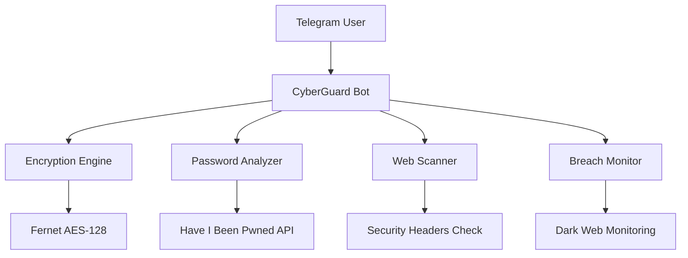

# 🤖 CyberGuard AI - Telegram Security Bot 2025


**The Ultimate AI-Powered Security Assistant for Telegram** - Protect your digital life with enterprise-grade security tools accessible through simple Telegram commands.

## 🚀 Overview

CyberGuard AI is a comprehensive security suite packaged as a Telegram bot, bringing professional-grade security tools to everyone. From encryption and password management to breach monitoring and website analysis - all accessible through intuitive Telegram commands.

## ✨ Features

### 🔐 Advanced Encryption
- **Military-grade encryption** using Fernet (AES 128)
- **Secure message encryption/decryption**
- **Unique key generation** for each operation
- **Base64 encoding** for easy sharing

### 🛡️ Password Security
- **AI-powered password generator** with multiple complexity levels
- **Real-time password strength analysis**
- **Breach monitoring** with Have I Been Pwned integration
- **Security scoring** with detailed recommendations

### 🌐 Web Security
- **Website security scanner** with TLS/SSL analysis
- **Security headers verification** (CSP, HSTS, X-Frame, etc.)
- **Vulnerability detection** for common web issues
- **Server information gathering**

### 📱 Utilities
- **Secure QR code generator** for sensitive data
- **Dark web monitoring** for email breaches
- **Security tips and best practices**
- **Multi-format support** for various data types

## 🏗️ Architecture



📦 Installation

Prerequisites

· Python 3.9 or higher
· Telegram Bot Token from @BotFather
· pip (Python package manager)

Step 1: Clone and Setup

```bash
git clone https://github.com/CHICO-CP/cyberguard-ai.git
cd cyberguard-ai
python -m venv venv
source venv/bin/activate  # Linux/Mac
# venv\Scripts\activate  # Windows
```

Step 2: Install Dependencies

```bash
pip install -r requirements.txt
```

Step 3: Configure Bot Token

Replace the token in cyberguard_bot.py:

```python
API_TOKEN = "YOUR_ACTUAL_BOT_TOKEN_HERE"
```

Step 4: Run the Bot

```bash
python cyberguard_bot.py
```

🎯 Usage

Getting Started

1. Search for your bot on Telegram
2. Send /start to see available commands
3. Use any command below to enhance your security

Available Commands

### Available Commands

#### 🔐 Encryption & Security
| Command | Description | Example |
|---------|-------------|---------|
| `/encrypt` | Encrypt sensitive messages | `/encrypt` → Follow prompts |
| `/decrypt` | Decrypt messages with key | `/decrypt` → Follow prompts |
| `/generatepassword` | Generate secure passwords | `/generatepassword` |
| `/checkpassword` | Analyze password strength | `/checkpassword` → Follow prompts |

#### 🌐 Web Analysis
| Command | Description | Example |
|---------|-------------|---------|
| `/scanwebsite` | Analyze website security | `/scanwebsite https://example.com` |
| `/checkbreach` | Check email in breaches | `/checkbreach email@example.com` |

#### 📱 Utilities
| Command | Description | Example |
|---------|-------------|---------|
| `/generateqr` | Generate QR codes | `/generateqr MySecretData` |
| `/securitytips` | Get security advice | `/securitytips` |
| `/help` | Show help menu | `/help` |
| `/about` | Bot information | `/about` |

🔧 Technical Details

Encryption Implementation

```python
# Fernet (AES-128) with unique key per operation
def encrypt_message(self, text, key=None):
    if not key:
        key = Fernet.generate_key()
    fernet = Fernet(key)
    encrypted = fernet.encrypt(text.encode())
    return encrypted, key
```

Security Headers Checked

· Content-Security-Policy
· X-Frame-Options
· X-Content-Type-Options
· Strict-Transport-Security
· X-XSS-Protection

Password Strength Algorithm

· Length scoring (8-16+ characters)
· Character variety (upper, lower, digits, symbols)
· Pattern detection (repetition, sequences)
· Entropy calculation (bit strength analysis)

📊 Sample Outputs

Password Analysis

```
🔍 Password Analysis

🛡️ VERY STRONG
📊 Score: 8/9
📏 Length: 16 characters
🔠 Uppercase: ✅
🔡 Lowercase: ✅
🔢 Numbers: ✅
⚡ Symbols: ✅
```

Website Security Scan

```
🔍 Security Analysis: https://example.com

🔒 HTTPS: ✅ Activated
🛡️ Security Headers:
✅ Content-Security-Policy
✅ X-Frame-Options
✅ X-Content-Type-Options
✅ Strict-Transport-Security
📡 Server: nginx/1.18.0
✅ No critical vulnerabilities found
```

Breach Check

```
🚨 SECURITY ALERT

📧 Email: user@example.com
🔓 Status: ❌ FOUND IN 3 BREACHES

⚠️ Recommended actions:
1. Change password immediately
2. Enable two-factor authentication
3. Check other accounts with same password
```

🔒 Security Features

Data Protection

· No data storage - All operations are ephemeral
· End-to-end encryption for sensitive data
· Local processing - No external data transmission
· Session management with automatic cleanup

Privacy Assurance

· No logs kept of user interactions
· Encrypted communications with Telegram
· Minimal data collection - only necessary information
· Transparent operations - users see all processes

🛡️ Ethical Usage

✅ Permitted Usage

· Personal security enhancement
· Authorized penetration testing
· Educational and research purposes
· Security awareness training

❌ Prohibited Usage

· Illegal hacking activities
· Unauthorized system testing
· Malicious attacks
· Any unlawful purposes

Legal Disclaimer

This tool is designed for educational and authorized security purposes only. Users are responsible for complying with all applicable laws and regulations. The developers are not liable for any misuse.

🐛 Troubleshooting

Common Issues

Bot not responding:

· Verify bot token is correct
· Check internet connection
· Ensure bot is not blocked

Encryption/decryption errors:

· Verify key is correct and complete
· Check for special characters in text
· Ensure proper base64 encoding

API timeouts:

· Check rate limits on external APIs
· Verify network connectivity
· Retry after few minutes

Performance Tips

· Use stable internet connection
· Avoid very large texts for encryption
· Close other bandwidth-intensive applications

🤝 Contributing

We welcome contributions from the security community! Here's how you can help:

Reporting Issues

1. Use GitHub Issues with detailed descriptions
2. Include error messages and steps to reproduce
3. Provide your environment details

Feature Requests

1. Open an issue with "Feature Request" label
2. Describe the use case and benefits
3. Suggest implementation approach if possible

Code Contributions

1. Fork the repository
2. Create a feature branch
3. Submit a pull request with clear description

Development Setup

```bash
git clone https://github.com/CHICO-CP/cyberguard-ai.git
cd cyberguard-ai
python -m venv venv
source venv/bin/activate
pip install -r requirements.txt
# Make your changes and test
```

📈 Future Roadmap

Planned Features

· Multi-language support (Spanish, French, German)
· Advanced threat intelligence integration
· PDF encryption/decryption capabilities
· Secure file sharing with expiration
· Blockchain-based verification
· AI-powered threat detection

Integration Plans

· Discord bot version
· Web dashboard interface
· Mobile app companion
· API for developers

👨‍💻 Developer

Ghost Developer

· GitHub: @CHICO-CP
· Telegram: @CodeBreakers

📄 License

This project is licensed under the MIT License - see the LICENSE file for details.

🙏 Acknowledgments

· Telegram for their robust Bot API
· Cryptography developers for security libraries
· Have I Been Pwned for breach data
· Security community for continuous improvements

📞 Support

Documentation

· Full Command Reference
· Troubleshooting Guide
· Security Best Practices

Community

· Telegram Channel
· GitHub Discussions
· Issue Tracker

Professional Support

For enterprise features or custom implementations, contact the developer directly.


<div align="center">

⭐ If this project helped you, please give it a star on GitHub!

"Security is not a product, but a process." - Bruce Schneier

</div>
